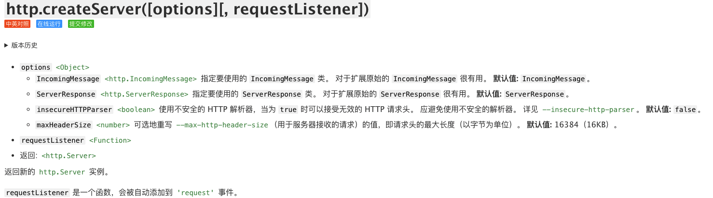
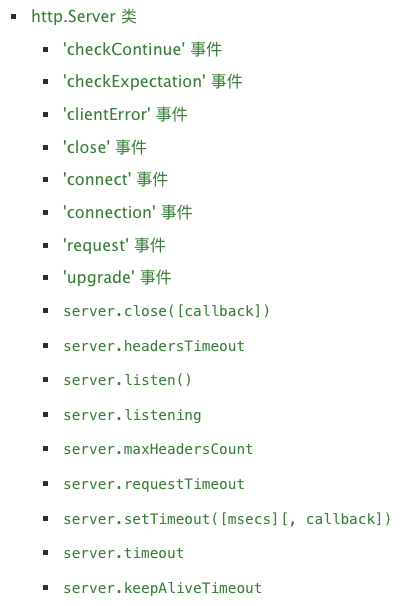
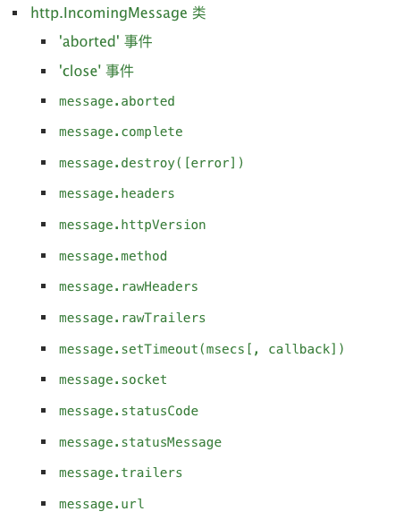

http可以说是nodejs中最核心的模块之一了，相比较于其他第三方的同功能的模块，http可以说比较底层，学习http模块，可以更好的理解nodejs的设计以及更好理解http协议相关。

<!-- more -->

http模块主要有以下几个子类构成：
- Agent
- ClientRequest
- Server
- ServerResponse
- IncomingMessage

还有几个方法组成：
- createServer()
- get()
- request()
- validateHeaderName()
- validateHeaderValue()

## 简单例子
我们通过简单的例子入手，学习一下内建的http模块相关知识点。
```ts
import { createServer, IncomingMessage, ServerResponse } from 'node:http';

createServer(function (req: IncomingMessage, res: ServerResponse) {
    res.writeHead(200, {
        "content-type": "text/plain"
    });
    res.write("hello world");
    res.end();
}).listen(3000);
```

上面代码是一个简单的http模块的hello world（用ts写的，因为用ts写可以更好的看出各个参数的具体类型，更有助于学习）。

我们使用createServer函数创建一个Server，并监听在3000端口。


createServer函数需要两个参数：options对象和requestListener函数。都是可选的。
上面的例子里，我们没有传入options参数，只传了requestListerner函数。这个函数即是请求处理函数，稍后再看。
返回值是一个http.Server实例，表示一个服务器实例。

Server有几个监听事件，以及几个方法，我们例子中用到的就是listen()方法，传一个端口号进去，配置服务器监听端口。其实listen()方法还可以传一个回调函数，用以表示服务器动后的回调处理。

使用typescript学习还有一个好处，我们可以在vscode中追踪各函数的签名，有具体的参数类型，更方便我们学习。

```ts
function createServer(requestListener?: RequestListener): Server;
function createServer(options: ServerOptions, requestListener?: RequestListener): Server;
```
createServer函数，在typescrit定义中，有两个定义，一个只传RequestListener请求监听函数，另一个传两个参数，ServerOtions服务器可选项和RequestListener请求监听函数，但实际上nodejs中只有一个createServer函数，传两个参数，都是可选的。typescript定义成两个签名是为了方便类型识别，这一点需要注意。

上面这个例子中，只传了一个请求监听函数，用来处理请求。这个函数类型是RequestListener。
```ts
type RequestListener = (req: IncomingMessage, res: ServerResponse) => void;
```
RequestListener即是一个无返回的函数，两个参数：`req:IncomingMessage`表示请求接收的消息，`res:ServerResponse`表示服务器返回的应答。

## IncomingMessage
IncomingMessage表示接收到的请求消息，所以，如果我们要接收客户端发来的信息，得从IncomingMessage对象获取。



```ts
import { createServer, IncomingMessage, ServerResponse } from 'http';

createServer(function (req: IncomingMessage, res: ServerResponse) {
    console.log(req.url);
    
    const chunks: any[] = [];
    req.on('data', (chunk)=>{
        chunks.push(chunk);
    }).on('end', ()=>{
        const body = Buffer.concat(chunks).toString('utf-8');
        console.log(`接收到请求body: ${body}`);

        res.writeHead(200, {
            "content-type": "application/json"
        });
        res.write(`{"body":"${body}"}`);
        res.end();
    }).on('close', () => {
        console.log('请求关闭');
    }).on('error', (err) => {
        console.log('请求出错:');
        console.log(err);
    });
    
    
}).listen(3000);
```


```typescript
const server1 = new Server((req: IncomingMessage, res: ServerResponse)=> {
    res.writeHead(200, {
        'content-type': 'text/plain'
    });
    res.write('hello on server1');
    res.end();
}).listen(3000, () => console.log('server1 监听在 3000'));
const server2 = new Server((req: IncomingMessage,res: ServerResponse) => {
    const clientRequest: ClientRequest = get('http://127.0.0.1:3000', (response: IncomingMessage)=>{
        const chunks: any[] = [];
        console.log(response.statusCode);
        response.on('data', (chunk)=>{
            chunks.push(chunk);
            console.log(Buffer.concat(chunks).toString());
            res.writeHead(200, {'content-type':'text/plain'});
            res.end(Buffer.concat(chunks).toString());
        }).on('end', () => {});
        
    })
    clientRequest.end();
}).listen(3001, () => console.log('server2 监听在 3001'));
```