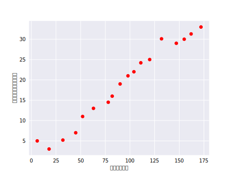
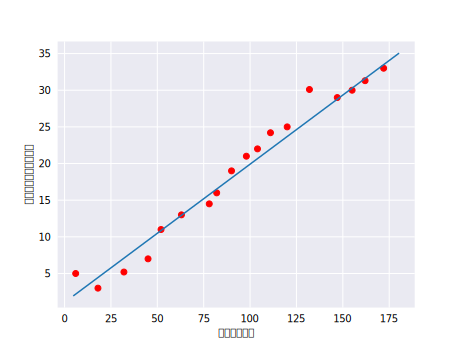
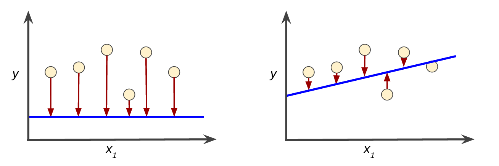

# 机器学习术语
## 机器学习
机器学习系统通过学习如何组合输入信息来对从未见过的数据作出有用的预测。

* 标签

  标签是我们要预测的事物，即简单线性回归中的y变量。标签可以是小麦未来的价格，图片中显示的动物品种，音频剪辑的含义或任何事物。

* 特征

  特征是输入变量，即简单性腺回归中的x变量，简单的机器学习项目可能会使用单个特征，而比较复杂的机器学习项目可能会使用数百万个特征，按如下方式指定：
  

  在垃圾邮件检测器中，特征可能包括：

    * 电子邮件文本中的字词
    * 发件人的地址
    * 发送电子邮件的时段
    * 电子邮件中包含“一种奇诡的把戏”这样的短语。

* 样本

  样本是指数据的特定实例： **x**。我们将样本分为以下两类：

  * 有标签样本

    有标签样本同事包含特征和标签，即: labeled examples: {features, label}: (x, y)
    我们使用有标签样本来训练模型，在我们的垃圾邮件检测器示例中，有标签样本是用户明确标记为“垃圾邮件”或“非垃圾邮件”的各个电子邮件。

  * 无标签样本

    无标签样本包含特征，但不包含标签，即：unlabeled examples: {features, ?}: (x, ?)
    在使用有标签样本训练了我们的模型之后，我们会使用该模型来预测无标签样本的标签。在垃圾邮件检测器示例中，无标签样本是用户尚未添加的新电子邮件。

* 模型

  模型定义了特征与标签之间的关系。例如，垃圾邮件检测器模型可能会将某些特征与“垃圾邮件”紧密联系起来。我们来重点介绍一下模型声明周期的两个阶段：

  * **训练** 表示创建或学习模型。也就是说，您向模型展示有标签样本，让模型逐渐学习特征与标签之间的关系
  * **推断** 表示将训练后的模型应用于无标签样本。也就是说，您使用训练后的模型来做出有用的预测（y）。例如，在推断期间，您可以针对新的无标签样本预测。

* 回归与分类

  **回归** 模型可预测连续值。例如，回归模型作出的预测可回答如下问题：

    * 加利福尼亚移动房产的价值是多少
    * 用户点击广告的概率是多少

  **分类** 模型可预测离散值。例如分类模型作出的预测可回答如下问题：

    * 某个指定电子邮件是垃圾邮件还是非垃圾邮件
    * 这是一张狗，猫还是藏书图片


## 线性回归
人们早就知晓，相比凉爽的天气，蟋蟀在较为炎热的天气里鸣叫更为频繁。数十年来，专业和业余昆虫学者已将每分钟的鸣叫声和温度方面的数据编入目录。Ruth 阿姨将她喜爱的蟋蟀数据库作为生日礼物送给您，并邀请您自己利用该数据库训练一个模型，从而预测鸣叫声与温度的关系。

首先建议您将数据绘制成图表，了解下数据的分布情况：



图：每分钟的名叫声与温度的关系

毫无疑问，此曲线图表明温度随着鸣叫声次数的增加而上升。鸣叫声与温度之间的关系是线性关系吗？是的，您可以绘制一条直线来近似地表示这种关系，如下所示：



图：线性关系

事实上，虽然该直线并未精确无误地经过每个点，但针对我们拥有的数据，清楚地显示了鸣叫声与温度之间的关系。只需运用一点代数知识，您就可以将这种关系写下来，如下所示：


其中：

* y 指的是温度（以摄氏度表示），即我们试图预测的值。
* m 指的是直线的斜率。
* x 指的是每分钟的鸣叫声次数，即输入特征的值。
* b 指的是 y 轴截距。

按照机器学习的惯例，你需要写一个存在细微差别的模型方程式：


其中：

* y' 指的是预测标签（理想输出值）。
* b 指的是偏差（y 轴截距）。而在一些机器学习文档中，它称为 w0
* w1 指的是特征 1 的权重。权重与上文中用m表示的“斜率”的概念相同。
* x 指的是特征（已知输入项）。

要根据新的每分钟的鸣叫声值x1推断（预测）温度 y'，只需将x1值代入此模型即可。

下标（例如 w1和 x1）预示着可以用多个特征来表示更复杂的模型。例如，具有三个特征的模型可以采用以下方程式：


## 训练与损失
简单来说，**训练** 模型表示通过有标签样本来学习（确定）所有权重和偏差的理想值。在监督式学习中，机器学习算法通过以下方式构建模型：检查多个样本并尝试找出可最大限度减少损失的模型，这一过程称为 **经验风险最小化**。

损失是对糟糕预测的称法。也就是说，损失是一个数值，表示对于单个样本而言，模型预测的准确程度。如果模型的预测完全准确，则损失为0，否则损失较大。训练模型的目标是从所有样本中找到一组平均损失较小的却中和偏差。例如，图2左侧显示的是损失较大的模型，右侧显示的是损失较小的模型。

关于此图，注意以下几点：

* 红色箭头表示损失
* 蓝色表示预测



请注意，左侧曲线图中的红色箭头比右侧曲线图中的对应红色箭头长得多。显然，相较于左侧曲线图中的蓝线，右侧曲线图中的蓝线代表的是预测效果更好的模型。

您可能想知道自己能否创建一个数学函数（损失函数），以有意义的方式汇总各个损失。

### 平方损失：一种常见的损失函数
接下来我们要看的线性回归模型使用的是一种称为 **平方损失（又称为 L2 损失）** 的损失函数。单个样本的平方损失如下：
```
= the square of the difference between the label and the prediction
= (observation - prediction(x))2
= (y - y')2
```
均方误差 (MSE) 指的是每个样本的平均平方损失。要计算 MSE，请求出各个样本的所有平方损失之和，然后除以样本数量：


其中：

* (x,y)指的是样本，其中
  * x指的是模型进行预测时使用的特征集（例如，文档，年里和交配成功率）
  * y指的是样本的标签（例如，每分钟的名叫次数）
* prediction(x)指的是权重和偏差与特征集x结合的函数
* D指的是包含多个有标签样本（即(x,y)）的数据集
* N指的是D的样本数量

虽然MSE常用与机器学习，但它既不是唯一实用的损失函数，也不是适用于所有情形的最佳损失函数。
