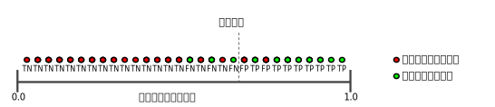
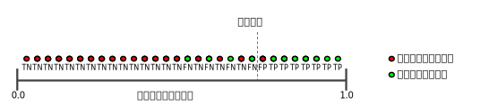
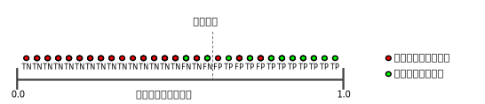

# 分组

## 分类 (Classification)：指定阈值

逻辑回归返回的是概率。您可以“原样”使用返回的概率（例如，用户点击此广告的概率为 0.00023），也可以将返回的概率转换成二元值（例如，这封电子邮件是垃圾邮件）。

如果某个逻辑回归模型对某封电子邮件进行预测时返回的概率为 0.9995，则表示该模型预测这封邮件非常可能是垃圾邮件。相反，在同一个逻辑回归模型中预测分数为 0.0003 的另一封电子邮件很可能不是垃圾邮件。可如果某封电子邮件的预测分数为 0.6 呢？为了将逻辑回归值映射到二元类别，您必须指定分类阈值（也称为判定阈值）。如果值高于该阈值，则表示“垃圾邮件”；如果值低于该阈值，则表示“非垃圾邮件”。人们往往会认为分类阈值应始终为 0.5，但阈值取决于具体问题，因此您必须对其进行调整。

我们将在后面的部分中详细介绍可用于对分类模型的预测进行评估的指标，以及更改分类阈值对这些预测的影响。

> 注意：“调整”逻辑回归的阈值不同于调整学习速率等超参数。在选择阈值时，需要评估您将因犯错而承担多大的后果。例如，将非垃圾邮件误标记为垃圾邮件会非常糟糕。不过，虽然将垃圾邮件误标记为非垃圾邮件会令人不快，但应该不会让您丢掉工作。

## 分类 (Classification)：真与假以及正类别与负类别

在本部分，我们将定义用于评估分类模型的指标的主要组成部分。不过，我们先来看一则寓言故事：

> 伊索寓言：狼来了（精简版）
有一位牧童要照看镇上的羊群，但是他开始厌烦这份工作。为了找点乐子，他大喊道：“狼来了！”其实根本一头狼也没有出现。村民们迅速跑来保护羊群，但他们发现这个牧童是在开玩笑后非常生气。
[这样的情形重复出现了很多次。]
一天晚上，牧童看到真的有一头狼靠近羊群，他大声喊道：“狼来了！”村民们不想再被他捉弄，都待在家里不出来。这头饥饿的狼对羊群大开杀戒，美美饱餐了一顿。这下子，整个镇子都揭不开锅了。恐慌也随之而来。

我们做出以下定义：

* “狼来了”是正类别。
* “没有狼”是负类别。

我们可以使用一个 2x2 混淆矩阵来总结我们的“狼预测”模型，该矩阵描述了所有可能出现的结果（共四种）：

|----|----|
|----|----|
|真正例 (TP)：    真实情况：受到狼的威胁。     牧童说：“狼来了”    结果：牧童是个英雄 |假正例 (FP)：  真实情况：没受到狼的威胁。  牧童说：“狼来了。”   结果：村民们因牧童吵醒他们而感到非常生气。|
|假负例 (FN)：  真实情况：受到狼的威胁。  牧童说：“没有狼”。   结果：狼吃掉了所有的羊。| 真负例 (TN)：  真实情况：没受到狼的威胁。   牧童说：“没有狼”。   结果：大家都没事。|

**真正例** 是指模型将正类别样本正确地预测为正类别。同样，**真负例** 是指模型将负类别样本正确地预测为负类别。

**假正例** 是指模型将负类别样本错误地预测为正类别，而 **假负例** 是指模型将正类别样本错误地预测为负类别。

在后面的部分中，我们将介绍如何使用从这四种结果中衍生出的指标来评估分类模型。

## 分类 (Classification)：准确率
准确率是一个用于评估分类模型的指标。通俗来说，准确率是指我们的模型预测正确的结果所占的比例。正式点说，准确率的定义如下：

对于二元分类，也可以根据正类别和负类别按如下方式计算准确率：

其中，TP = 真正例，TN = 真负例，FP = 假正例，FN = 假负例。

让我们来试着计算一下以下模型的准确率，该模型将 100 个肿瘤分为恶性 （正类别）或良性（负类别）：

|-----|----|
|-----|----|
| 真正例 (TP)：   真实情况：恶性   机器学习模型预测的结果：恶性   TP 结果数：1 | 假正例 (FP)：  真实情况：良性   机器学习模型预测的结果：恶性   FP 结果数：1|
| 假负例 (FN)：   真实情况：恶性   机器学习模型预测的结果：良性   FN 结果数：8 | 真负例 (TN)：   真实情况：良性   机器学习模型预测的结果：良性   TN 结果数：90 |

准确率为 0.91，即 91%（总共 100 个样本中有 91 个预测正确）。这表示我们的肿瘤分类器在识别恶性肿瘤方面表现得非常出色，对吧？

实际上，只要我们仔细分析一下正类别和负类别，就可以更好地了解我们模型的效果。

在 100 个肿瘤样本中，91 个为良性（90 个 TN 和 1 个 FP），9 个为恶性（1 个 TP 和 8 个 FN）。

在 91 个良性肿瘤中，该模型将 90 个正确识别为良性。这很好。不过，在 9 个恶性肿瘤中，该模型仅将 1 个正确识别为恶性。这是多么可怕的结果！9 个恶性肿瘤中有 8 个未被诊断出来！

虽然 91% 的准确率可能乍一看还不错，但如果另一个肿瘤分类器模型总是预测良性，那么这个模型使用我们的样本进行预测也会实现相同的准确率（100 个中有 91 个预测正确）。换言之，我们的模型与那些没有预测能力来区分恶性肿瘤和良性肿瘤的模型差不多。

当您使用 **分类不平衡的数据集**（比如正类别标签和负类别标签的数量之间存在明显差异）时，单单准确率一项并不能反映全面情况。

在下一部分中，我们将介绍两个能够更好地评估分类不平衡问题的指标：精确率和召回率。

## 分类 (Classification)：精确率和召回率

### 精确率
精确率指标尝试回答以下问题：

> 在被识别为正类别的样本中，确实为正类别的比例是多少？

精确率的定义如下：

> 注意：如果模型的预测结果中没有假正例，则模型的精确率为 1.0。

让我们来计算一下上一部分中用于分析肿瘤的机器学习模型的精确率：

|----|-----|
|----|-----|
|真正例 (TP)：1	|假正例 (FP)：1|
|假负例 (FN)：8	|真负例 (TN)：90|

精确率 

该模型的精确率为 0.5，也就是说，该模型在预测恶性肿瘤方面的正确率是 50%。

### 召回率

召回率尝试回答以下问题：

> 在所有正类别样本中，被正确识别为正类别的比例是多少？

从数学上讲，召回率的定义如下：

召回率

> 注意：如果模型的预测结果中没有假负例，则模型的召回率为 1.0。

让我们来计算一下肿瘤分类器的召回率：

|----|----|
|----|----|
|真正例 (TP)：1	|假正例 (FP)：1|
|假负例 (FN)：8	|真负例 (TN)：90|

召回率

该模型的召回率是 0.11，也就是说，该模型能够正确识别出所有恶性肿瘤的百分比是 11%。

### 精确率和召回率：一场拔河比赛
要全面评估模型的有效性，必须同时检查精确率和召回率。遗憾的是，精确率和召回率往往是此消彼长的情况。也就是说，提高精确率通常会降低召回率值，反之亦然。请观察下图来了解这一概念，该图显示了电子邮件分类模型做出的 30 项预测。分类阈值右侧的被归类为“垃圾邮件”，左侧的则被归类为“非垃圾邮件”。

图 1. 将电子邮件归类为垃圾邮件或非垃圾邮件。

我们根据图 1 所示的结果来计算精确率和召回率值：

|----|----|
|----|----|
|真正例 (TP)：8	|假正例 (FP)：2|
|假负例 (FN)：3	|真负例 (TN)：17|

精确率指的是被标记为垃圾邮件的电子邮件中正确分类的电子邮件所占的百分比，即图 1 中阈值线右侧的绿点所占的百分比：

召回率指的是实际垃圾邮件中正确分类的电子邮件所占的百分比，即图 1 中阈值线右侧的绿点所占的百分比：

图 2 显示了提高分类阈值产生的效果。

图 2. 提高分类阈值。

假正例数量会减少，但假负例数量会相应地增加。结果，精确率有所提高，而召回率则有所降低：

|----|----|
|----|----|
|真正例 (TP)：7	|假正例 (FP)：1|
|假负例 (FN)：4	|真负例 (TN)：18|

相反，图 3 显示了降低分类阈值（从图 1 中的初始位置开始）产生的效果。

图 3. 降低分类阈值。

假正例数量会增加，而假负例数量会减少。结果这一次，精确率有所降低，而召回率则有所提高：

|----|----|
|----|----|
|真正例 (TP)：9	|假正例 (FP)：3|
|假负例 (FN)：2	|真负例 (TN)：16|

我们已根据精确率和召回率指标制定了各种指标。有关示例，请参阅 F1 值。

## 分类 (Classification)：ROC 和曲线下面积

### ROC曲线
**ROC曲线（接收者操作特征曲线）** 是一种显示分类模型在所有分类阈值下的效果图标。该曲线绘制了以下两个参数：

* 真正例率
* 假正例率
