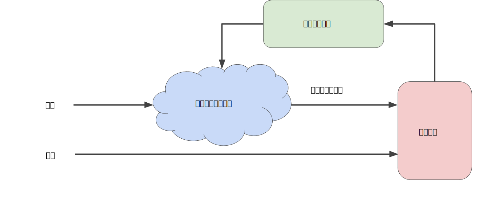
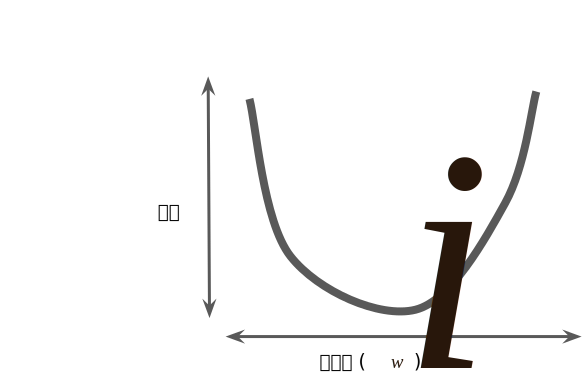
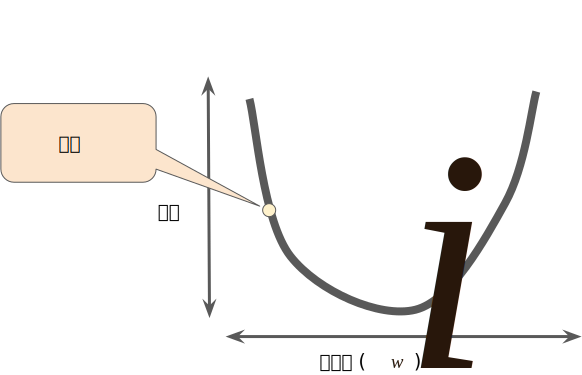
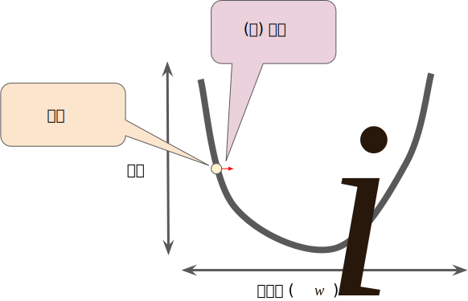
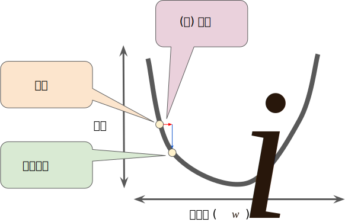
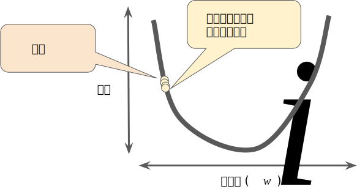
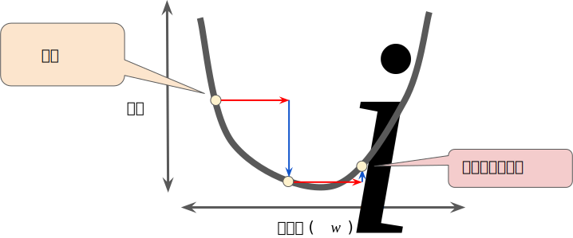
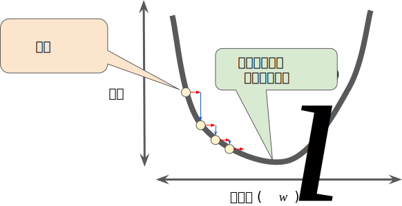

# 降低损失
## 迭代方法
迭代学习可能会让你想到“Hot and Cold”这种寻找隐藏物品的游戏。在我们的游戏中，“隐藏的物品”就是最佳模型。刚开始，你会胡乱猜想（w1的值为0），等待系统告诉你损失是多少，最后你再尝试另一种猜想(w1的值是0.5)，看看损失是多少。哎呀，这次更接近目标了。
实际上，如果你以正确的方式玩这个游戏，通常会越来越接近目标。这个游戏真正棘手的地方在于，尽可能高效的找到最佳模型。

下图显示了机器学习算法用于训练模型的迭代试错过程：
 

我们将在整个机器学习速成课程中使用相同的迭代方法详细说明各种复杂的情况，尤其是处于暴风雨中的蓝云区域。
迭代策略在机器学习中的应用非常普遍，这主要是因为他们可以很好的拓展到大型数据集。

“模型”部分将一个或多个特征作为输入，然后返回一个预测（y’）作为输出，为了进行简化，不妨考虑一种采用一个特征并返回一个预测的模型：


我们应该为b和w1设置哪些初始值？对于线性回归问题，事实证明初始值并不重要。我们可以随机选择值，不过我们还是选择采用以下这些无关紧要的值：

* b = 0
* w1 = 0

假设第一个特征值是10，该特征值带入预测函数也会得到以下结果：

```
y' = 0 + 0 * (10)
y' = 0
```
图中的“计算损失”部分是模型将要使用的损失函数，假设我们使用平方损失函数，损失函数将采用两个输入值：

* y': 模型对特征x的预测
* y: 特征x对应的正确标签

最后我们来看图的“计算参数更新”部分。机器学习系统就是在此部分检查损失函数的值，并为 b 和 w1 生成新值。现在，假设这个神秘的绿色框会产生新值，然后机器学习系统将根据所有标签进行重新评估所有特征，为损失函数生成一个新值，而该值有产生新的参数值。这种学习过程会持续迭代，知道该算法发现损失可能最低的模型参数。通常，你可以不断迭代，知道总体损失不再变化或至少变化及其缓慢为止。这时候，我们可以说，该模型已 **收敛** 。

## 梯度下降算法
迭代方法图包含一个标题为“计算参数更新”的华而不实的绿色框。现在我们将用更实质的方法代替这种华而不实的算法。

假设我们有时间和计算资源来计算 w1 的所有可能值的损失。对于我们一致在研究的回归问题，锁产生的损失与 w1 的图形始终是凸型。换言之，图形始终是碗状图，如下所示：



图：回归问题产生的损失与权重图为凸形

凸型问题只有一个最低点，即值存在一个斜率正好为0的位置。这个最小值就是损失函数收敛之处。

通过计算整个数据集中 w1 每个可能值的损失函数来找到收敛点这种方法效率太低。我们来研究一种更好的机制，这种机制在机器学习领域非常热门，称为  **梯度下降法** 。

梯度下降法的第一个阶段是为 w1 选择一个起始值（起点）。起点并不重要，因此很多算法就直接将 w1 设为0或随机选择一个值。下图显示的是我们选择了一个稍大于0的起点：



图：梯度下降法的起点

然后梯度下降法算法会计算损失曲线在起点处的梯度，简而言之，梯度是偏导数的矢量；它可以让你了解哪个方向举例目标更近或更远。请注意，损失相对于单个权重的梯度就等于导数。

### 详细了解偏导数和梯度
请注意，梯度是一个矢量，因此具有以下两个特征：

* 方向
* 大小

梯度始终指向损失函数中增长最为迅猛的方向。梯度下降算法会沿着负梯度的方向走一步，以便尽快降低损失。



图：梯度下降法依赖于负梯度

为了确定损失函数曲线上的下一个点，梯度下降算法会将梯度大小的一部分与起点相加，如下图所示：



图：一个梯度步长将我们移动到损失曲线上的下一个点。

然后，梯度下降算法会重复此过程，逐渐接近最低点。

## 学习速率
正如之前所述，梯度矢量具有方向和大小。梯度下降法算法用梯度乘以一个称为学习速率（有时也称为步长）的标量，以确定下一个点的位置。例如，如果梯度大小为 2.5，学习速率为 0.01，则梯度下降法算法会选择距离前一个点 0.025 的位置作为下一个点。

超参数是编程人员在机器学习算法中用于调整的旋钮。大多数机器学习编程人员会花费相当多的时间来调整学习速率。如果您选择的学习速率过小，就会花费太长的学习时间：



图：学习速率过小


相反，如果您指定的学习速率过大，下一个点将永远在 U 形曲线的底部随意弹跳，就好像量子力学实验出现了严重错误一样：



图：学习速率过大


每个回归问题都存在一个金发姑娘学习速率。“金发姑娘”值与损失函数的平坦程度相关。如果您知道损失函数的梯度较小，则可以放心地试着采用更大的学习速率，以补偿较小的梯度并获得更大的步长。



图：学习速率正好

> ### 详细了解理想的学习速率
> 一维空间中的理想学习速率是 (f(x)对x的二阶导数的倒数)

> 二维或多维空间中的理想学习速率是 *海森矩阵*（由二阶偏导数组成的矩阵）的倒数

> 广义凸函数的情况则更为复杂。


## 随机梯度下降法
在梯度下降法中，**批量** 指的是用于在单次迭代中计算梯度的样本总数。到目前为止，我们一直假定批量是指整个数据集。就 Google 的规模而言，数据集通常包含数十亿甚至数千亿个样本。此外，Google 数据集通常包含海量特征。因此，一个批量可能相当巨大。如果是超大批量，则单次迭代就可能要花费很长时间进行计算。

包含随机抽样样本的大型数据集可能包含冗余数据。实际上，批量大小越大，出现冗余的可能性就越高。一些冗余可能有助于消除杂乱的梯度，但超大批量所具备的预测价值往往并不比大型批量高。

如果我们可以通过更少的计算量得出正确的平均梯度，会怎么样？通过从我们的数据集中随机选择样本，我们可以通过小得多的数据集估算（尽管过程非常杂乱）出较大的平均值。 **随机梯度下降法 (SGD)** 将这种想法运用到极致，它每次迭代只使用一个样本（批量大小为 1）。如果进行足够的迭代，SGD 也可以发挥作用，但过程会非常杂乱。“随机”这一术语表示构成各个批量的一个样本都是随机选择的。

**小批量随机梯度下降法（小批量 SGD）** 是介于全批量迭代与 SGD 之间的折衷方案。小批量通常包含 10-1000 个随机选择的样本。小批量 SGD 可以减少 SGD 中的杂乱样本数量，但仍然比全批量更高效。

为了简化说明，我们只针对单个特征重点介绍了梯度下降法。请放心，梯度下降法也适用于包含多个特征的特征集。

