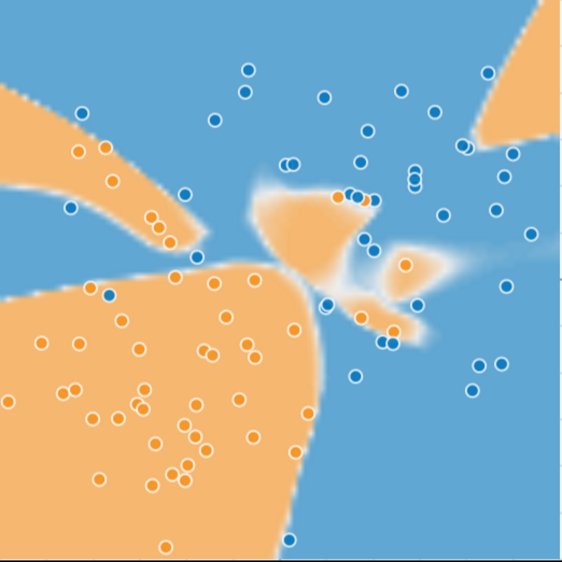
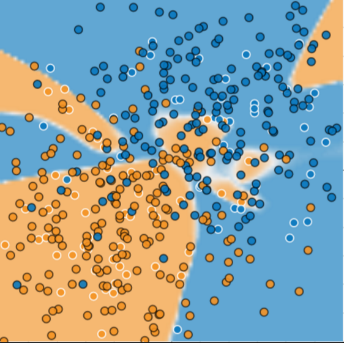

# 泛化
泛化是指模型很好的拟合以前从未见过的新数据（从用于创建该模型的同一分布中抽取）的能力。

## 泛化：过拟合的风险
本单元我们将重点介绍泛化。为了让你直观的理解这一概念，我们将展示3张图。
假设这些图中的每个点代表一棵树在森林中的位置，图中的两种颜色分别代表以下含义：

* 蓝点代表生病的树
* 橙点代表健康的树

接下来，我们看看图1:

图1：生病（蓝色）和健康（橙色）的树

你能设想出一个有效的模型来预测以后的生病或健康的树么？花点时间在脑海里绘制一条弧线将蓝点与橙点分开，或者在脑海中圈住一些橙点或蓝点。然后再看看图2，它显示某种机器学习模型如何将生病的树与健康的树区分开。请注意，该模型产生的损失非常低。

图2:用于区分生病的树与健康的树的复杂模型

乍一看，图 2 所示的模型在将健康的树与生病的树区分开方面似乎表现得非常出色。真的是这样吗？

## 损失很低，但仍然是糟糕的模型？
图3显示我们想该模型中添加了新数据后发生 的情况。结果表明，该模型在处理新数据方面表现的非常糟糕。请注意，该模型对大部分新数据的分类都不正确。

图3:该模型在预测新数据方面表现非常糟糕

图2和图3所示的模型 **过拟合** 了训练数据的特性。过拟合模型在训练过程中产生的损失很低，但在预测新数据方面的表现却非常糟糕。
如果某个模型在拟合当前样本方面表现良好，那么我们如何相信该模型会对新数据作出良好的预测呢？
过拟合是由于模型的复杂程度超出锁需要程度而造成的。机器学习的基本冲突是适当拟合我们的数据，但也要尽可能简单的拟合数据。

机器学习的目标是对从真实概率分布（已隐藏）中抽取的新数据做出良好预测。遗憾的是，模型无法查看整体情况；模型只能从训练数据集中取样。
如果某个模型在拟合当前样本方面表现良好，那么你如何相信该模型也会对从未见过的样本做出良好的预测呢？

奥卡姆的威廉是14世纪一位崇尚简单的修士和哲学家。他认为科学家应该优先采用更简单（而非更复杂）的公式或理论。奥卡姆剃刀定律在机器学习方面的应用如下：
> 机器学习模型越简单越好，良好的实证结果就越有可能不仅仅基于样本的特性。

现今，我们已将奥卡姆剃刀定律正式应用于统计学理论和计算学习理论领域。这些领域已经形成了泛化边界，即统计化描述模型根据以下因素泛化到新数据的能力：

* 模型的复杂程度
* 模型在处理训练数据方面的表现

虽然理论分析在理想化假设下可提供正式保证，但在时间中却很难应用。机器学习速成课则侧重于实力评估，以评判模型泛化到新数据的能力。

机器学习模型旨在根据以前未见过的数据做出良好预测。但是，如果你要根据数据集构建模型，如何获得以前未见过的数据呢？一种方法是将你的数据集分成两个子集：

* 训练集： 用于训练模型的子集
* 测试集： 用于测试模型的子集

一般来说，在测试机上表现是否良好是衡量能否在新数据上表现良好的有用指标，前提是：

* 测试集足够大
* 你不会反复使用相同的测试集来作假

## 机器学习细则
以下三项基本假设阐明了泛化：

* 我们从分布中随机抽取 **独立同分布(i.i.d)** 的样本。换言之，样本之间不会互相影响。
* 分布是平稳的，即分布在数据集内不会发生变化。
* 我们从同一分布的数据划分中抽取样本。包括训练集、验证集和测试集.

在实践中，我们优势会违背这些假设，例如：

* 想象有一个选择要展示的广告的模型。如果该模型在某种程度上根据用户以前看过的广告选择广告，则会违背`i.i.d.`假设
* 想象有一个包含一年零售信息的数据集，用户的购买行为会出现季节性变化，这会违反平稳性

如果违背了上述三项基本假设中的任何一条，那么我们就必须密切注意指标。

> ## 总结
> * 如果某个模型尝试紧密拟合训练数据，却不能很好的泛化到新数据，就会发生过拟合
> * 如果不符合监督式机器学习的关键假设，那么我们将市区对新数据进行预测这项能力的重要理论保证。  