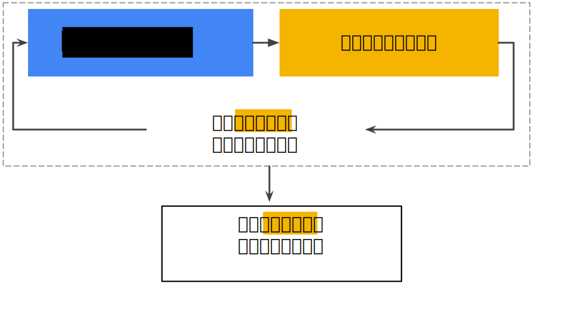
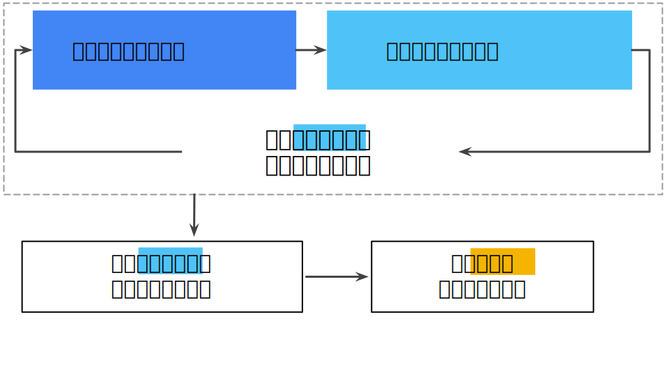

# 验证
通过将数据集划分为训练集和测试集，你可以判断给定模型能否很好的泛化到新数据。不过，当进行多轮超参数调整时，仅仅使用两类数据可能不太够。

### 另一个划分
采用两种分类后，工作流程可能如下所示：

图1: 可能的工作流程

在图中，“调整模型”指的是调整你可以想到的关于模型的任何方面，从更改学习速率，添加或移除特征，到从头开始设计全新模型，该工作流程结束时，你可以选择在测试集上获得最佳效果的模型。

将数据集划分为两个子集是个不错的想法，但不是万能良方。通过将数据集划分为三个子集（如下图所示），你可以大幅降低过拟合的发生机率：

图2: 将单个数据集划分为三个子集

使用 **验证集** 评估训练集的效果。然后，在模型“通过”验证集之后，使用测试集再次检查评估结果。下图展示了这一新工作流程：

图3: 更好的工作流程

在这一经过改进的工作流程中：

* 选择在验证集上获得最佳效果的模型
* 使用测试集两次检查该模型

该工作流程之所以更好，原因在于它暴露给测试集的信息更少。

> ## 提示
> 不断使用测试集和验证集会使其逐渐失去效果。也就是说，你使用相同数据来决定超参数设置或其他模型改进的次数越多，你对于这些结果能够真正泛化到未见过的新数据的信心就越低。请注意，验证集的失效速度通常比测试集缓慢。

> 如果可能的话，建议你收集更多数据来“刷新”测试集和验证集。重新开始是一种很好的重置方式。