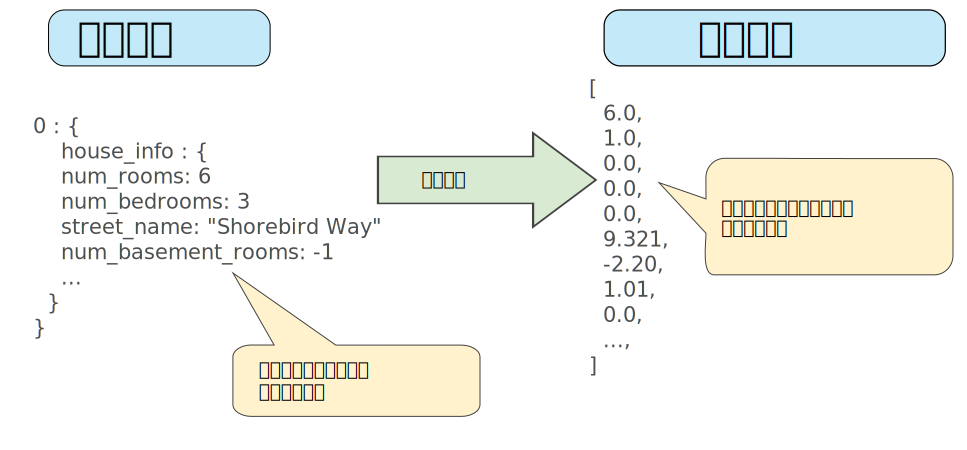
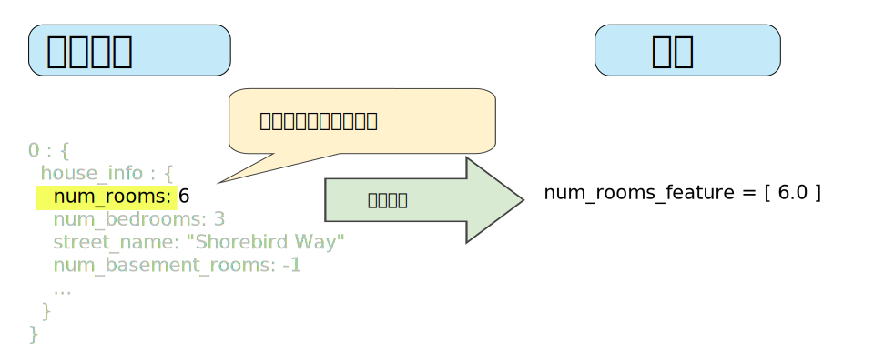
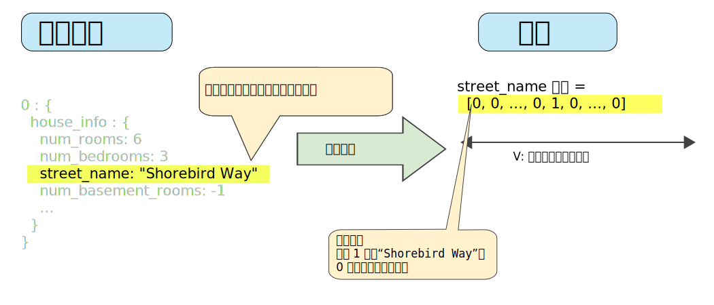
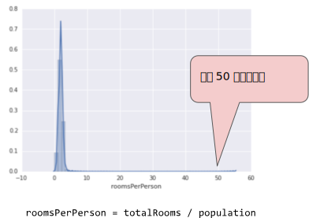
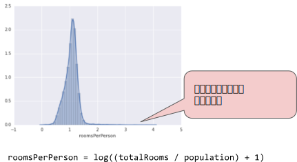
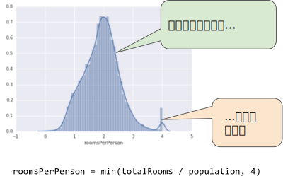
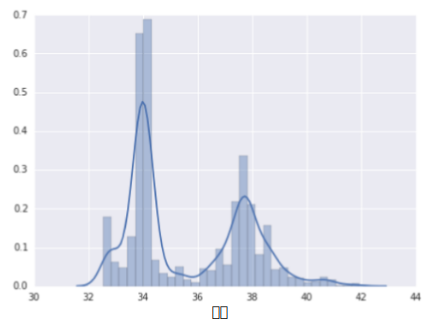
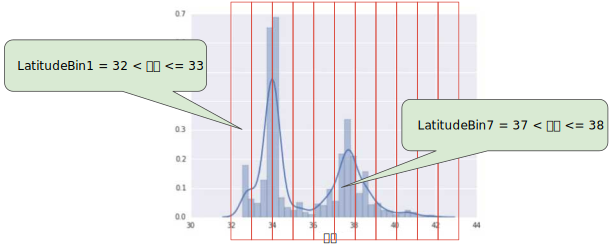

# 表示法
## 特征工程

传统编程的关注点是代码，在机器学习项目中，关注点变成了表示。也就是说，开发者通过添加和改善特征来调整模型。

### 将原始数据映射到特征
图1左侧表示来自输入数据源的原始数据，右侧表示 **特征矢量** ，也就是组成数据集中样本的浮点值集。
**特征工程** 指的是将原始数据转换为特征矢量。进行特征工程预计需要大量时间。



图1: 程序工程将原始数据映射到机器学习特征


机器学习模型通常期望样本表示为 **实数矢量** 。这种矢量的构建方法如下：为每个字段衍生特征，然后将它们全部连接到一起。

#### 映射数值
机器学习模型根据 **浮点值** 进行训练，因此整数和浮点原始数据不需要特征编码。正如图2所示，将原始数值6转换为特征值 6.0 是没有意义的：



图2: 将整数值映射到浮点数值

#### 映射字符串
模型无法通过字符串学习规律，因此您需要进行一些特征工程来将这些值转换为数字形式：
1. 首先，为你要表示的所有特征的字符串定义一个 **词汇表** 。对于 street_name 特征， 该词汇表中将包含你知道的所有的街道。
    > 注意：所有其他街道都可以归入一个笼统的“其他”类别，该类别称为 **OOV(未收录词汇表)桶** 。
2. 然后，使用该词汇表创建一个 **独热编码** ，用于将指定字符串表示为二元矢量。在该矢量（与指定的字符串对应）中：
    * 只有一个元素为 1
    * 其他所有元素均设为 0
    该矢量的长度等于词汇表中的元素数。
图3显示了某条特征街道的独热编码。在此二元矢量中，代表 shorebird way 的元素的值为1， 而代表其他街道的元素的值为0



图3: 通过独热编码映射字符串值。

#### 映射分类（枚举）值
分类特征具有一组离散的可能值。例如名为 Lowland Countries 的特征只包含3个可能值：

```
{'Netherlands', 'Belgium', 'Luxembourg'}
```

你可能会将分类特征编码为枚举类型或表示不同值的整数离散集。例如：

* 将荷兰表示为 0
* 将比利时表示为 1
* 将卢森堡表示为 2

不过，机器学习模型通常将每个分类特征表示为单独的布尔值。例如， Lowland Countries 在模型中可以表示为3个单独的布尔值特征：

* x1： 是荷兰么？
* x2: 是比利时么？
* x3: 是卢森堡么？

采用这种方法编码还可以简化某个值可能属于多个分类这种情况（例如，“与法国接壤”对于比利时和卢森堡来说都是 True）。


## 良好特征的特点
我们探索了将原始数据映射到合适特征矢量的方法，但这只是工作的一部分。现在，我们必须探索什么样的值才算这些特征矢量中良好的特征。

### 避免很少使用的离散特征值
良好的特征值应该在数据集中出现大约5次以上。这样一来，模型就可以学习该特征值与标签是如何关联的。也就是说，大量离散值相同的样本可让模型有机会了解不同设置中的特征，从而判断何时可以对标签很好的作出预测。例如 house_type 特征可能包含大量样本，其中它的值为 victorian:

> house_type: victorian

相反，如果某个特征值的值仅出现一次或者很少出现，则模型就无法根据该特征进行预测。例如 unique_house_id 就不适合作为特征，因为每个值只出现一次，该模型无法从中学习任何规律：

> ~~unique_house_id: 8SK982ZZ1242Z~~

### 最好具有清晰明确的语义
每个特征对于项目中的任何人来说都应该具有清晰明确的语义。例如，下面的房龄适合作为特征，可立即识别为年龄：

> house_age: 27

相反的，对于下方特征值的含义，除了创建它的工程师，其他人恐怕辨识不出：

> ~~house_age: 851472000~~

在某些情况下，混乱的数据（而不是糟糕的工程选择）会导致不清晰的值。例如，以下 user_age 的来源没有检查值恰当与否：

> ~~user_age: 277~~

### 不要将“神奇”的值与实际数据混为一谈
良好的浮点特征不包含超出范围的异常断点或“神奇”的值。例如，假设一个特征具有0到1之间的浮点值。那么，如下值是可以接受的：

> quality_rating: 0.82

> quality_rating: 0.37

不过，如果用户没有输入 quality_rating ， 则数据集可能使用如下神奇值来表示不存在该值：

> ~~quality_rating: -1~~

为解决神奇值的问题，需将该特征转换为两个特征：

* 一个特征只存储质量评分，不含神奇值
* 一个特征存储布尔值，表示是否提供了 quality_rating。为该布尔值特征指定一个名称，例如 is_quality_rating_defined。

### 考虑上游不稳定性
特征的含义不应随时间发生变化。
例如，下列值是有用的，因为城市名称一般不会发生改变。（注意，我们仍然需要将“br/sao_paulo”这样的字符串转换为独热矢量。）

> city_id: "br/sao_paulo"

但收集由其他模型推理的值会产生额外成本。可能值“219”目前代表圣保罗，但这种表示在未来运行其他模型时可能轻易发生变化：

> ~~inferred_city_cluster: "219"~~


## 数据清理
苹果树结出的果子有品相上乘的，也有虫蛀坏果。而在便利店出售的苹果是 100% 完美的水果。从果园到水果店之间，专门有人花费大量的时间将坏苹果剔除或给可以挽救的苹果涂上一层薄薄的蜡。作为一名机器学习工程师，你将花费大量的时间挑出坏样本并加工可以挽救的样本。即使是非常少量的“坏苹果”也会破坏掉一个大规模数据集。

### 缩放特征值
**缩放** 是指将浮点特征值从自然范围（例如100到900）转换为标准范围（例如0到1或者-1到+1）.如果某个特征集只包含一个特征，则缩放可以提供的实际好处微乎其微或者根本没有。不过如果特征集包含多个特征，则缩放特征可以带来以下优势：

* 帮助梯度下降更快速的收敛
* 帮助避免“NaN陷阱”。在这种陷阱中，模型中的一个数值变成NaN（例如，当某个值在训练期间超出了浮点精确率限制时），并且模型中的所有其他数值最终也会因数学运算而变成NaN.
* 帮助模型为每个特征确定何时的权重。如果没有进行特征缩放，则模型会对范围较大的特征投入过多的精力。

你不需要对每个特征进行完全的缩放。即使特征A的范围是 -1到+1，同时特征B的范围是 -3到+3，也不会产生什么恶劣的影响。不过如果特征B的范围是 5000到100000，你的模型会出现糟糕的响应。

> 要缩放数字数据，一种显而易见的方法是将 [最小值，最大值] 以线性方式映射到较小的范围，例如 [-1，+1]。

> 另一种热门的缩放策略是计算每个值的 Z 得分。Z 得分与距离均值的标准偏差数相关。换而言之：

> 

> 例如，给定以下条件：

> * 均值 = 100

> * 标准偏差 = 20

> * 原始值 = 130

> 则：

>  * scaled_value = (130 - 100) / 20

>  * scaled_value = 1.5

> 使用 Z 得分进行缩放意味着，大多数缩放后的值将介于 -3 和 +3 之间，而少量值将略高于或低于该范围。


### 处理极端离群值
下面的曲线图表示的是加利福尼亚州住房数据集中称为 roomsPerPerson 的特征。roomsPerPerson 值的计算方法是相应地区的房间总数除以相应地区的人口总数。该曲线图显示，在加利福尼亚州的绝大部分地区，人均房间数为 1 到 2 间。不过，请看一下 x 轴。



图：一个非常非常长的尾巴

如何最大限度降低这些极端离群值的影响？一种方法是对每个值取对数：



图：对数缩放仍然留有尾巴

对数缩放可稍稍缓解这种影响，但仍然存在离群值这个大尾巴。我们采用另一种方法。如果我们只是简单的将 roomsPerPerson 的最大值“限制”为某个任意值（比如4.0），会发生什么情况呢？



图： 将特征值限制到4.0


将特征值限制到4.0并不意味着我们忽略所有大于4.0的值。而是说，所有大于4.0的值都将变成4.0.这就解释了4.0处哪个有趣的小峰值，但是缩放后的特征集现在依然比原始数据有用。

### 分箱
下面的曲线图显示了加利福尼亚不同唯独房屋相对普及率。注意集群洛杉矶大致在维度34处，旧金山大致在维度38处。



图：每个维度的房屋数

在数据集中，latitude 是一个浮点值。不过，在我们的模型中将 latitude 表示为浮点特征没有意义。这是因为纬度和房屋价值之间不存在线性关系。例如，纬度 35 处的房屋并不比纬度 34 处的房屋贵 35/34（或更便宜）。但是，纬度或许能很好地预测房屋价值。

为了将纬度变为一项实用的预测指标，我们对纬度“分箱”，如下图所示：



图： 分箱值

我们现在拥有 11 个不同的布尔值特征（LatitudeBin1、LatitudeBin2、…、LatitudeBin11），而不是一个浮点特征。拥有 11 个不同的特征有点不方便，因此我们将它们统一成一个 11 元素矢量。这样做之后，我们可以将纬度 37.4 表示为：

```
[0, 0, 0, 0, 0, 1, 0, 0, 0, 0, 0]
```

分箱之后，我们的模型现在可以为每个纬度学习完全不同的权重。

>为了简单起见，我们在纬度样本中使用整数作为分箱边界。如果我们需要更精细的解决方案，我们可以每隔 1/10 个纬度拆分一次分箱边界。添加更多箱可让模型从纬度 37.4 处学习和维度 37.5 处不一样的行为，但前提是每 1/10 个纬度均有充足的样本可供学习。

>另一种方法是按分位数分箱，这种方法可以确保每个桶内的样本数量是相等的。按分位数分箱完全无需担心离群值。


### 清查

截至目前，我们假定用于训练和测试的所有数据都是值得信赖的。在现实生活中，数据集中的很多样本是不可靠的，原因有以下一种或多种：

* **遗漏值**。 例如，有人忘记为某个房屋的年龄输入值。
* **重复样本**。 例如，服务器错误地将同一条记录上传了两次。
* **不良标签**。 例如，有人错误地将一颗橡树的图片标记为枫树。
* **不良特征值**。 例如，有人输入了多余的位数，或者温度计被遗落在太阳底下。

一旦检测到存在这些问题，您通常需要将相应样本从数据集中移除，从而“修正”不良样本。要检测遗漏值或重复样本，您可以编写一个简单的程序。检测不良特征值或标签可能会比较棘手。

除了检测各个不良样本之外，您还必须检测集合中的不良数据。直方图是一种用于可视化集合中数据的很好机制。此外，收集如下统计信息也会有所帮助：

* 最大值和最小值
* 均值和中间值
* 标准偏差

考虑生成离散特征的最常见值列表。例如，country:uk 的样本数是否符合您的预期？language:jp 是否真的应该作为您数据集中的最常用语言？

### 了解数据
遵循以下规则：

* 记住您预期的数据状态。
* 确认数据是否满足这些预期（或者您可以解释为何数据不满足预期）。
* 仔细检查训练数据是否与其他来源（例如信息中心）的数据一致。

像处理任何任务关键型代码一样谨慎处理您的数据。良好的机器学习依赖于良好的数据。
