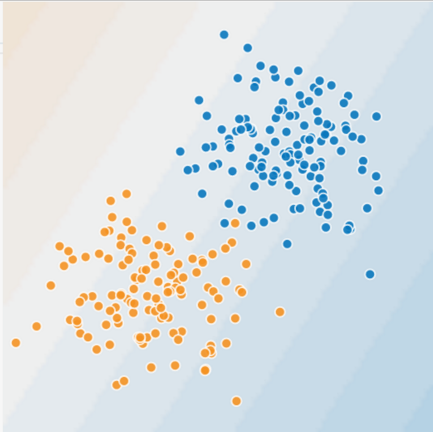
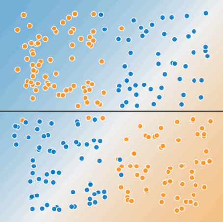

# 特征组合

## 对非线性规律进行编码

在图1和图2中，我们作出如下假设：

* 蓝点代表生病的树
* 橙点代表健康的树



图1: 这是线性问题吗？

你可以画一条线将生病的树与健康的树清晰的分开吗？当然可以。这是线性问题。这条线并不完美。有一两棵生病的树可能位于“健康的”一侧，但你画的这条线可以很好的作出预测。

现在，我们来看看下图：


图2: 这时线性问题吗？

你可以画一条直线将生病的树与健康的树清晰的分开吗？不，你做不到。这是个非线性问题。你画的任何一条线都不能很好的预测树的健康状况。




图3: 一条线无法分开两类数据。

要解决图2所示的非线性问题，可以创建一个特征组合。 **特征组合** 是指通过将两个或多个输入特征相乘来对特征空间中的非线性规律进行编码的合成特征。“cross”（组合）这一术语来自 'cross product'(向量积)。我们通过将 x1 与 x2 组合来创建一个名为 x3 的特征组合：


我们像处理任何其他特征一样来处理这个新建的 x3 特征组合。线性公式变为：


线性算法可以算出 w3 的权重，就像算出 w1 和 w2 的权重一样。换言之，虽然 w3 表示非线性信息，但你不需要改变线性模型的训练方式来确定 w3 的值。

### 特征组合的种类

我们可以创建很多不同种类的特征组合。例如：

* [A x B] : 将两个特征的值相乘的特征组合
* [A x B x C x D x E]: 将五个特征的值相乘形成的特征组合。
* [A x A]: 对单个特征的值求平方形成的特征组合。

通过采用随机梯度下降法，可以有效的训练线性模型。因此，在使用拓展的线性模型时辅以特征组合一直都是训练大规模数据集的有效方法。


## 组合独热矢量
到目前为止，我们已经重点介绍了如何对两个单独的浮点特征进行特征组合。 在实践中，机器学习模型很少会组合连续特征。
不过，机器学习模型却经常组合独热特征矢量，将独热特征矢量的特征组合视为逻辑连接。
例如，假设我们具有以下两个特征：国家/地区和语言。对每个特征进行独热编码会生成具有二元特征的矢量，这些二元特征可解读为 `country=USA, country=France` 或 `language=English, language=Spanish`。然后，如果你对这些独热矢量编码进行特征组合，则会得到可解读为逻辑连接的二元特征，如下表示：

```
contry: usa AND language: spanish
```

再举一个例子，假设你对纬度和经度进行分箱，获得单独的独热5元素特征矢量。例如，指定的纬度和经度可以表示如下：

```
binned_latitude = [0, 0, 0, 1, 0]
binned_longitude = [0, 1, 0, 0, 0]
```

假设你对这两个特征矢量创建了组合特征：

```
binned_latitude X binned_longitude
```

此特征组合是一个25元素独热矢量（24个0和1个1）。该组合中的单个1表示纬度与经度的特定连接。然后，你的模型就可以了解到有关这种连接的特定关联性。

假设，我们更粗略的对纬度和经度进行分箱，如下所示：

```
binned_latitude(lat) = [
  0  < lat <= 10
  10 < lat <= 20
  20 < lat <= 30
]

binned_longitude(lon) = [
  0  < lon <= 15
  15 < lon <= 30
]
```

针对这些粗略分箱创建特征组合会生成具有以下含义的组合特征：

```
binned_latitude_X_longitude(lat, lon) = [
  0  < lat <= 10 AND 0  < lon <= 15
  0  < lat <= 10 AND 15 < lon <= 30
  10 < lat <= 20 AND 0  < lon <= 15
  10 < lat <= 20 AND 15 < lon <= 30
  20 < lat <= 30 AND 0  < lon <= 15
  20 < lat <= 30 AND 15 < lon <= 30
]
```

现在，假设我们的模型需要根据以下两个特征来预测狗主人对狗狗的满意程度：

* 行为类型（吠叫，叫，偎依等）
* 时段

如果我们根据这两个特征构建以下特征组合：

```
[behavior type X time of day]
```

我们最终获得的预测能力将远远超过任一特征单独的预测能力。
例如，如果狗狗在下午5点主人下班回来时（快乐的）叫喊，可能表示对主人满意度的正面预测结果。
如果狗狗在凌晨3点主人熟睡时（也许痛苦的）哀叫，可能表示对主人满意度的强烈负面预测结果。

线性学习器可以很好的拓展到大量数据。对大规模数据集使用特征组合是学习高度复杂模型的一种有效策略。

神经网络可提供另一种策略。


