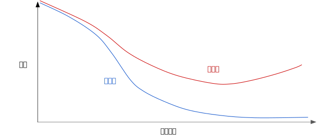
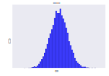
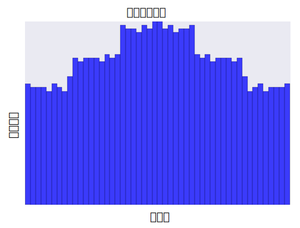

# 正则化：简单性
## 简化正则化： L2正则化

请查看以下泛化曲线，该曲线显示的是训练集和验证集相对于训练迭代次数的损失。

图1: 训练集和验证集损失。

图1显示的是某个训练模型的训练损失逐渐减少，但验证损失最终增加。
换言之，该泛化曲线显示该模型与训练集中的数据 **过度拟合** 。
根据 奥卡姆剃刀定律，或许我们可以通过降低复杂模型的复杂度来防止过度拟合，这种原则称为 **正则化** 。

也就是说，并非只是以最小化损失（经验风险最小化）为目标：

而是以最小化损失和复杂度为目标，这称为 **结构风险最小化** :

现在，我们的训练优化算法是一个由两项内容组成的函数：一个是 **损失项** ，用于衡量模型与数据的拟合度，另一个是 **正则化项** ,用于衡量模型复杂度。

机器学习速成课程重点介绍了两种衡量模型复杂度的常见方式（这两种方式有些相关）：

* 将模型复杂度作为模型中所有特征的权重的函数
* 将模型复杂度作为具有非零权重的特征总数的函数

如果模型复杂度是权重的函数，则特征权重的绝对值越高，对模型复杂度的贡献就越大。

我们可以使用 L2 正则化 公式来量化复杂度，该公式将正则化项定义为所有特征权重的平方和：

在这个公式中，接近于0的权重对模型复杂度几乎没有影响，而离群值权重则可能会产生巨大的影响。

例如，某个线性模型有以下权重：

L2正则化项为 26.915:

但是 w3（上述加粗内容）的平方值为25，几乎贡献了全部的复杂度。所有5个其他权重的平方和对 L2 正则化项的贡献仅为 1.915。

## Lambda
模型开发者通过以下方式来调整正则化项的整体影响：用正则化项的值乘以名为 **lambda** (又称为 **正则化率** )的标量。
也就是说，模型开发者会执行以下运算：

执行 L2 正则化对模型具有以下影响

* 使权重值接近于 0（但并非正好为 0）
* 使权重的平均值接近于 0，且呈正态（钟形曲线或高斯曲线）分布。

增加 lambda 值将增强正则化效果。 例如，lambda 值较高的权重直方图可能会如图 2 所示。

图2: 权重直方图

降低lambda的值往往会得出比较平缓的直方图，如图3所示：

图3: 较低lambda值得出的权重直方图。

在选择lambda值时，目标是在简单化和训练数据拟合之间达到适当的平衡：

* 如果您的 lambda 值过高，则模型会非常简单，但是您将面临数据欠拟合的风险。您的模型将无法从训练数据中获得足够的信息来做出有用的预测。

* 如果您的 lambda 值过低，则模型会比较复杂，并且您将面临数据过拟合的风险。您的模型将因获得过多训练数据特点方面的信息而无法泛化到新数据。

> 注意：将 lambda 设为 0 可彻底取消正则化。 在这种情况下，训练的唯一目的将是最小化损失，而这样做会使过拟合的风险达到最高。

理想的lambda值生成的模型可以很好的泛化到以前从未见过的新数据。遗憾的是，理想的lambda值取决于数据，因此你需要手动或自动进行一些调整。

学习速率和lambda之间存在密切关联。强L2正则化值往往会使特征权重更接近于0。较低的学习速率（使用早停法）通常会产生相同的效果，因为与0的距离并不是很远。因此，同时调整学习速率和lambda可能会产生令人混淆的效果。

**早停法** 指的是在模块完全收敛之前就结束训练。在实际操作中，我们经常在以在线（连续）方式进行训练时采取一些隐式早停法。
也就是说，一些新趋势的数据尚不足以收敛。

如上所述，更改正则化参数产生的效果可能会与更改学习速率或迭代次数产生的效果相混淆。一种有用的做法（在训练一批固定的数据时）是执行足够多次迭代，这样早停法便不会起作用。
