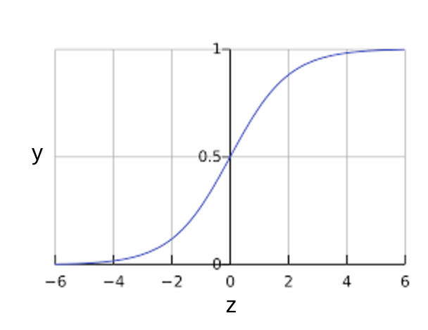
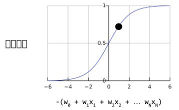

# 逻辑回归
## 计算概率
许多问题需要将概率估算值作为输出。
逻辑回归是一种极其高效的概率计算机制。实际上，你可以通过以下两种方式之一使用返回的概率：

* 按原样
* 转换成二元类别

我们来了解以下如何“按原样”使用概率。假设我们创建一个逻辑回归模型来预测狗在半夜发出叫声的概率。我们将此概率称为：

```
p(bark | night)
```

如果逻辑回归模型预测 `p(bark | night)`的值为0.05，那么一年内，狗的主人应该被惊醒约18次：

```
startled = p(bark | night) * nights
18 ~= 0.05 * 365
```

在很多情况下，你会将逻辑回归输出映射到二元分类问题的解决方案，该二元分类问题的目标是正确预测两个可能的标签（例如，“垃圾邮件”或“非垃圾邮件”）中的一个。之后的单元会重点介绍这一内容。

你可能想知道逻辑回归模型如何确保输出值始终落在 0 和 1 之间。巧合的是， **S型函数** 生成的输出值正好具有这些特性，其定义如下：


S型函数会产生以下曲线：



图1: S型函数

如果z表示使用逻辑回归训练的模型是线性层的输出，则S型(z)函数会生成一个介于 0 和 1 之间的值（概率）。用数学方法表示为：


其中：

* y'是逻辑回归模型针对特定样本的输出
* z是 b + w1x1 + w2x2 + … wNxN
    * w值是该模型学习的权重和偏差
    * x值是特定样本的特征值

请注意，z也称为对数几率，因为S型函数的反函数表明，z可定义为标签“1”（例如“狗叫”）的概率除以标签“0”（例如“狗不叫”）的概率得出的值的对数：


以下是具有机器学习标签的 S 型函数：



图2: 逻辑回归输出。

### 逻辑回归推断计算

假设我们的逻辑回归模型具有学习了下列偏差和权重的三个特征：

* b=1
* w1=2
* w2=-1
w3=5

进一步假设给定样本具有以下特征值：

* x1=0
* x2=10
* x3=2

因此，对数几率：


将是：
(1) + (2)(0) + (-1)(10) + (5)(2) = 1

因此，此特定样本的逻辑回归预测值将是 0.731:




图3: 73.1% 的概率。


## 训练模型

### 逻辑回归的损失函数
线性回归的损失函数是平方损失。
逻辑回归的损失函数是 **对数损失函数** ，定义如下：


其中：

* (xy)ϵD 是包含很多有标签样本 (x,y) 的数据集。
* “y”是有标签样本中的标签。由于这是逻辑回归，因此“y”的每个值必须是 0 或 1。
* “y'”是对于特征集“x”的预测值（介于 0 和 1 之间）。

对数损失函数的方程式与 Shannon 信息论中的熵测量密切相关。它也是似然函数的负对数（假设“y”属于伯努利分布）。实际上，最大限度地降低损失函数的值会生成最大的似然估计值。

### 逻辑回归中的正则化

正则化在逻辑回归建模中极其重要。如果没有正则化，逻辑回归的渐进性会不断促使损失在高纬度空间达到0.
因此，大多数逻辑回归模型会使用以下两个策略之一来降低模型复杂性：

* L2正则化
* 早停法。即限制训练步数或学习速率

假设您向每个样本分配一个唯一 ID，且将每个 ID 映射到其自己的特征。如果您未指定正则化函数，模型会变得完全过拟合。这是因为模型会尝试促使所有样本的损失达到 0 但始终达不到，从而使每个指示器特征的权重接近正无穷或负无穷。当有大量罕见的特征组合且每个样本中仅一个时，包含特征组合的高维度数据会出现这种情况。

幸运的是，使用 L2 或早停法可以防止出现此类问题。


### 总结
* 逻辑回归模型会生成概率。
* 对数损失函数是逻辑回归的损失函数。
* 逻辑回归被很多从业者广泛使用。


