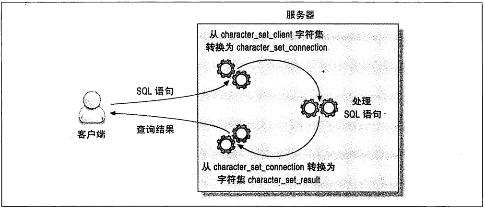

# mysql高级特性
## 分区表
对用户来说，分区表是一个独立的逻辑表，但是底层由多个物理子表组成。实现分区表的代码实际上是对一组底层表的句柄对象的封装。对分区表的请求，都会通过句柄对象转化成对存储引擎的接口调用。

mysql实现分区表的方式----对底层表的封装----意味着索引也是按照分区的子表定义的，而没有全局索引。

分区的一个主要目的是将数据按照一个较粗的粒度分在不同的表中，这样做可以将相关数据存放在一起，另外，如果想一次批量删除整个分区的数据也会变的很方便。

下面的场景中，分区可以起到非常大的作用：

* 表非常大以至于无法全部都放到内存中，或者只在表的最后部分有热点数据，其他均是历史数据。
* 分区表的数据更容易维护。例如想批量删除大量数据可以使用清除整个分区的方式。另外，还可以对一个独立分区进行优化，检查，修复等操作。
* 分区表的数据可以分布在不同的物理设备上，从而高效的利用多个硬件设备。
* 可以使用分区表来避免某些特殊的瓶颈，例如InnoDB的单个索引的互斥访问，ext3文件系统的inode锁竞争等。
* 如果需要，还可以备份和恢复独立的分区，这在非常大的数据集的场景下效果非常好。

分区表本身也有一些限制：

* 一个表最多只能有1024个分区
* 在mysql5.1中，分区表达式必须是整数，或者是返回整数的表达式，在mysql5.5 中，某些场景中可以直接使用列来进行分区。
* 如果分区字段中有主键或者唯一索引的列，那么所有主键列和唯一索引列都必须包含进来。
* 分区表中无法使用外键约束。

### 分区表的原理
分区表上的操作按照下面的操作逻辑进行：

* select查询
  当查询一个分区表的时候，分区层先打开并锁住所有的底层表，优化器先判断是否可以过滤部分分区，然后再调用对应的存储引擎接口访问各个分区的数据。
* insert操作
  当写入一条记录时，分区层先打开并锁住所有的底层表，然后确定哪个分区接收这条记录，再将记录写入对应底层表。
* delete操作
  当删除一条记录时，分区层先打开并锁住所有的底层表，然后确定数据对应的分区，最后对相应底层表进行删除操作。
* update操作
  当更新一条记录时，分区层先打开并锁住所有的底层表，mysql先确定需要更新的记录在哪个分区，然后取出数据并更新，再判断更新后的数据应该放在哪个分区，最后对底层表进行写入操作，并对原数据所在的底层表进行删除操作。

虽然每个操作都会“先打开并锁住所有的底层表”，但这并不是说分区表在处理过程中是锁住全表的，如果存储引擎能够自己实现行级锁，如InnoDB，则会在分区层释放对应表锁。这个加锁和解锁过程与普通InnoDB上的查询类似。

### 分区表的类型
mysql支持多种分区表，我们看到最多的是根据范围进行分区，每个分区存储落在某个范围的记录，分区表达式可以是列，也可以是包含列的表达式。

```sql
create table sales(
   order_date datetime not null,
   -- other columns omitted
  ) engine=innodb partition by range(year(order_date)) (
    partition p_2010 values less than (2010),
    partition p_2011 values less than (2011),
    partition p_2012 values less than (2012),
    partition p_catchall  values less than maxvalue
    );
```

partition分区子句中可以使用各种函数，但有一个要求，表达式返回的值要是一个确定的整数，且不能是一个常数。

mysql还支持键值，哈希和列表分区，这其中有些还支持子分区，不过我们在生产环境中很少见到。

我们还看到的一些其他的分区技术包括：

* 根据键值进行分区，来减少InnoDB的互斥竞争。
* 使用数据模函数来进行分区，然后将数据轮询放入不同的分区。
* 假设表有一个自增的主键列id，希望根据时间将最近的热点数据集中存放，那么必须将时间戳包含在主键当中才行，而这和主键本身的意义相矛盾，这种情况下可以使用这样的分区表达式来实现相同的目的：Hash(id div 100000) ，这将为100万数据建立一个分区，这样一方面实现了当初的分区目的，另一方面比起使用时间范围分区还避免了一个问题，就是当超过一定阀值时，如果使用时间范围分区就必须新增分区。

### 如何使用分区表
假设我们希望从一个非常大的表中查询出一段时间的记录，而这个表中包含了很多年的历史数据，数据是按照时间排序的，例如希望查询最近几个月的数据，这大约有10亿条记录。

首先很肯定：因为数据量巨大，肯定不能在每次查询的时候都扫描全表。考虑到索引在空间和维护上的消耗，也不希望使用索引。即使真的使用索引，你会发现数据并不是按照想要的方式聚集的，而且会有大量的碎片产生，最终会导致一个查询产生成千上万的随机I/O，应用程序也随之僵死。

这时候有两条路可选：让所有的查询都只在数据表上做顺序扫描或者将数据表和索引全部都缓存在内存里。

这里需要再陈述一遍：在数据量大的时候，B-Tree索引就无法起作用了。除非是索引覆盖查询，否则数据库服务器需要根据索引扫描的结果回表，查询所有符合条件的记录，如果数据量巨大，这将产生大量随机I/O，随之，数据库的响应时间将达到不可接受的程度。

另外，索引维护的代价也非常高。

这正是分区要做的事情。理解分区时还可以将其当作索引的最初形态，以代价非常小的方式定位到需要的数据在哪一片“区域”，在这篇区域中，你可以做顺序扫描，还可以建索引，还可以将数据都缓存到内存，等等。

因为分区无需额外的数据结构记录每个分区有哪些数据--分区不需要精确定位每条数据的位置，也就无需额外的数据结构--所以其代价非常低，只需要一个简单的表达式就可以表达每个分区存放的是什么数据。

为了保证大数据量的可拓展性，一般有下面两个策略：

* 全量扫描数据，不需要任何索引
  可以使用简单的分区方式存放表，不要任何索引，根据分区的规则大致定位需要的数据位置。只要能够使用where条件，将需要的数据限制在少数分区中，则效率是很高的。当然，也需要做一些简单的运算保证查询的响应时间能够满足需求。使用该策略假设不用将数据完全放入到内存中，同时还假设需要的数据全都在磁盘上，因为内存相对很小，数据很快会被挤出内存，所以缓存起不了任何作用。这个策略适用于以正常的方式访问大量数据的时候。
* 索引数据，并分离热点
  如果数据有明显的热点，而且除了这部分数据，其他数据很少被访问到，那么可以将这部分热点数据单独放到一个分区中，让这个分区的数据能够有机会都缓存在内存中。这样查询就可以值访问一个很小的分区表，能够使用索引，也能够有效的使用缓存。

### 什么情况下会出问题
上面我们介绍的两个分区策略都是基于两个非常重要的假设：查询能够过滤掉很多额外的分区，分区本身并不会带来很多额外的代价。而事实证明，这两个假设在某些场景下会有问题。

* NULL值会使分区过滤无效
    关于分区表，一个容易让人误解的地方就是分区的表达式的值可以是null，第一个分区是一个特殊分区。假设按照partition by range year(order_date)分区，那么所有order__date为null或者是一个非法值的时候，记录都会被存放到第一个分区。

    如果第一个分区非常大，特别是当使用全量扫描数据，不要任何索引的策略时，代价会非常大。而且扫描两个分区来查找列也不是我们使用分区表的初衷。
    
    为了避免这种情况，可以创建一个“无用”的第一个分区，例如上面的例子中可以使用partition p_nulls values less than (0) 来创建第一个分区。如果插入表中的数据都是有效的，那么第一个分区就是空的，这样即使需要检测第一个分区，代价也会非常小。在mysql5.5中就不需要这个优化技巧了，因为可以直接使用列本身而不是基于列的函数进行分区。
* 分区列和索引列不匹配
  如果定义的索引列和分区列不匹配，会导致查询无法进行分区过滤。
* 选择分区的成本可能很高
* 打开并锁住所有底层表的成本可能很高
  当查询访问分区表的时候，mysql需要打开并锁住所有的底层表，这是分区表的另一个开销。这个操作在分区过滤之前发生，所以无法通过分区过滤降低此开销，并且该开销也和分区类型无关，会影响所有的查询。
* 维护分区的成本可能很高

### 查询优化
分区最大的有点是优化器可以根据分区函数来过滤一些分区，根据粗粒度索引的优势，通过分区过滤通常可以查询扫描更少的数据。

对于分区表来说，很重要的一点是要在where条件中带入分区列，有时候即使看似 多余的也要带上，这样就可以让优化器能够过滤掉无需访问的分区。如果没有这些条件，mysql就需要让对应的存储引擎访问这个表的所有分区，如果表非常大的话，就可能会非常慢。

mysql只能在使用分区函数的列本身进行比较时才能过滤分区，而不能根据表达式的值去过滤分区，即使这个表达式就是分区函数也不行。

## 视图
mysql5.0版本之后开始引入视图。视图本身是一个虚拟表，不存放任何数据，在使用sql语句访问视图的时候，它返回的数据是mysql从其他表中生成的。

视图和表是在同一个命名空间，mysql在很多地方对于视图和表是同样对待的。不过视图和表也有不同，例如不能对视图创建触发器，也不能使用drop table命令删除视图。

mysql可以使用两种办法处理视图：合并算法和临时表算法。如果可能尽可能使用合并算法。

* 使用MERGE策略，MySQL会先将输入的查询语句和视图的声明语句进行合并，然后执行合并后的语句并返回。但是如果输入的查询语句中不允许包含一些聚合函数如: MIN, MAX, SUM, COUNT, AVG, etc., or DISTINCT, GROUP BY, HAVING, LIMIT, UNION, UNION ALL, subquery。同样如果视图声明没有指向任何数据表，也是不允许的。如果出现以上任意情况, MySQL默认会使用UNDEFINED策略。
* 使用TEMPTABLE策略，MySQL先基于视图的声明创建一张temporary table，当输入查询语句时会直接查询这张temporary table。由于需要创建temporary table来存储视图的结果集, TEMPTABLE的效率要比MERGE策略低，另外使用temporary table策略的视图是无法更新的。

如果你想确定mysql到底是使用合并算法还是临时表算法，可以explain一条针对视图的简单查询：

```sql
explain select * from <view_name>
+----+-------------+------------+------------+--------+---------------+---------+---------+-------------------+------+----------+-------------+
| id | select_type | table      | partitions | type   | possible_keys | key     | key_len | ref               | rows | filtered | Extra       |
+----+-------------+------------+------------+--------+---------------+---------+---------+-------------------+------+----------+-------------+
| 1  | PRIMARY     | <derived2> | <null>     | ALL    | <null>        | <null>  | <null>  | <null>            | 34   | 100.0    | <null>      |
| 2  | DERIVED     | blog       | <null>     | index  | user_id       | user_id | 4       | <null>            | 34   | 100.0    | Using index |
| 2  | DERIVED     | u          | <null>     | eq_ref | PRIMARY       | PRIMARY | 4       | test.blog.user_id | 1    | 100.0    | Using where |
+----+-------------+------------+------------+--------+---------------+---------+---------+-------------------+------+----------+-------------+
```

这里的select_type为derived，说明该视图是采用的临时表算法实现的。

### 可更新视图
可更新视图是指可以通过更新这个视图来更新视图涉及的相关表。只要指定了合适的条件，就可以更新，删除甚至向视图中写入数据。

如果视图定义中包含了group by, union, 聚合函数，以及其他一些特殊情况，就不能被更新了。

更新视图的查询也可以是一个关联语句，但是有一个限制，被更新的列必须来自同一个表中，另外，所有使用临时表算法实现的视图都无法被更新。

### 视图对性能的影响
可以使用视图实现基于列的权限控制，却不需要真正的在系统中创建列权限，因此没有额外的开销。

如果打算使用视图来提升性能，需要做比较详细的测试。即使合并算法实现的视图也会有额外的开销，而且视图的性能很难预测。

在mysql优化器中，视图的代码执行路径也完全不同，这部分代码测试还不透全面，可能会有一些音层缺陷和问题。所以我们认为视图还不是那么成熟。

### 视图的限制
mysql还不支持物化视图（将视图结果数据存放在一个可以查看的表中，并定期从原始表中刷新数据到这个表中）.

mysql也不支持在视图中创建索引。不过可以使用构建缓存表或者汇总表的办法来模拟物化视图和索引。

mysql视图实现上也有一些让人烦恼的地方，例如，mysql并不会保存视图定义的原始sql语句，所以打算通过执行 show create view 后在简单的修改其结果的方式来重新定义视图，可能会大失所望。show create view出来的视图创建语句将以一种不友好的内部格式呈现，充满了各种转义符和引号，没有代码格式，没有注释，也没有缩进。

## 外键约束
使用外键是有成本的，比如外键通常都要求每次在修改数据时都要在另外一张表中多执行一次查找操作。

虽然InnoDB强制外键使用索引，但还是无法消除这种约束检查的开销。如果外键列的选择性很低，则会导致一个非常大且选择性低的索引.

不过在某些场景下，外键会提升一些性能。如果想确保两个相关表始终有一致的数据，那么使用外键比在应用程序中检查一致性的性能要高得多，此外，外键在相关数据的删除和更新上，也比在应用中维护要更高效，不过外键维护操作是逐行进行的，所以这样的更新会比批量删除和更新要慢些。

外键约束使得查询需要额外访问一些别的表，这也意味着需要额外的锁。如果向子表中插入一条记录，外键约束会让InnoDB检查对应的父表记录，也就需要对父表对应记录进行加锁操作，来确保这条记录不会在这个事务完成之时就被删除了。这回导致额外的锁等待，甚至会导致一些死锁。

如果只是使用外键做约束，那通常在应用程序里实现该约束会更好。外键会带来很大的额外消耗。

## 在mysql内部存储代码
mysql允许通过触发器，存储过程，函数的形式来存储代码，从mysql5.1开始，还可以在定时任务中存放代码，这个定时任务也被称为“事件”。存储过程和存储函数都被统称为“存储程序”。

在mysql中使用存储代码的优点：

* 它在服务器内部执行，离数据最近，在服务器上执行还可以节省带宽和网络延迟
* 这是一种代码重用。可以方便的统一业务规则，保证某些行为总是一致，所以也可以为应用提供一定的安全性。
* 它可以简化代码的维护和版本更新
* 它可以帮助提升安全，比如提供更细粒度的权限控制。
* 服务器可以缓存存储过程的执行计划，这对于需要反复调用的过程，会大大降低消耗
* 因为是在服务器部署的，所以备份，维护都可以在服务器端完成。所以存储程序的维护工作会很简单。
* 它可以在应用开发和数据库开发人员之间更好的分工。不过最好是由数据库专家来开发存储过程，因为不是每个应用开发人员都能写出高效的sql查询。

存储代码也有如下缺点：

* mysql本身没有提供好用的开发和调试工具，所以编写msyql的存储代码比其他的数据要更难
* 较之应用程序的代码，存储代码效率要稍微差些。例如存储代码中可以使用的函数非常有限，所以使用存储代码很难编写复杂的字符串为好功能，也很难实现太复杂的逻辑
* 存储代码可能会给应用程序代码的部署带来额外的复杂性。原本只需要部署应用代码和库表结构，现在还要额外的部署mysql内部的存储代码
* 因为存储程序都部署在服务器，所以可能有安全隐患。如果将非标准的加密功能放在了存储程序中，那么若数据库被攻破，数据也就泄漏了。但是若将加密函数放在应用程序代码中，那么攻击者必须同时攻破程序和数据库才能获得数据。
* 存储过程会给数据库增加额外的压力，而数据库服务器的拓展性香饼应用服务器要差很多
* mysql并没有什么选项可以控制 存储程序的资源消耗，所以在存储过程中的一个小错误，可能直接把服务器拖死
* 存储代码在mysql中的实现也有很多限制--执行计划是连接级别的，游标的物化和临时表相同，在mysql5.5版本之前，异常处理也非常困难，等等
* 调试mysql的存储过程是一件很困难的事情。
* 它和基于语句的二进制日志复制合作的并不好。

最后，存储代码是一种帮助应用隐藏复杂性，使得应用开发更简单的方法。不过，它的性能可能更低，而且会给MySQL的复制等增加潜在的风险。所以当你打算使用存储过程的时候，需要问问自己，到底希望程序逻辑在哪儿实现：是数据库中还是应用代码中？这两种做法都可以，也都很流行。只是当你编写存储代码的时候，你需要明白这是将程序逻辑放在数据库中。 

## 绑定变量
当创建一个绑定变量sql时，客户端向服务器发送了一个sql语句的原型。服务器收到这个sql语句框架后，解析并存储这个sql语句的部分执行计划，返回给客户端一个sql语句处理句柄。以后每次执行这类查询 ，客户端都指定使用这个句柄。

绑定变量sql使用问号标记可以接收参数的位置，当真正需要执行具体查询的时候，则使用具体值代替这些问号。

* 在服务器只解析一次sql语句
* 在服务器端某些优化器的工作只需要执行一次，因为它会缓存一部分的执行计划。
* 以二进制的方式只发送参数和句柄，比起每次都发送ascii码文本效率更高，一个二进制的日期字段只需3个字节，但如果是ascii则需要10个字节。
* 仅仅是参数，而不是整个查询语句，需要发送到服务器端，所以网络开销少
* mysql在存储参数的时候，直接将其存放到缓存中，不再需要在内存中多次复制。

绑定变量相对也更安全，无需在应用程序中处理转义，一则更简单了，二则也大大减少了sql注入和攻击风险。

### 绑定变量的限制
* 绑定变量是会话级别的，所以连接之间不能共用绑定变量句柄。
* 并不是所有的时候使用绑定变量都能获得更好的性能。如果只是执行一次sql，那么使用绑定变量无疑比直接执行多了一次额外的准备阶段消耗，而且还需要一次额外的网络消耗。
* 如果总是忘记释放绑定变量资源，则在服务器端很容易发生资源“泄漏”。绑定变量sql总数的限制是一个全局限制，所以在某一个地方的错误可能会对所有其的线程都产生影响。

## 字符集和校对
字符集是指一种从二进制编码到某类字符符号的映射，校对是指一组用于某个字符集的排序规则。

### mysql如何使用字符集
每种字符集都可能有多种校对规则，并且都有一个默认的校对规则。

MySQL的设置可以分为两类：`创建对象的时的默认值`， `在服务器和客户端通信时的设置`。

1. 创建对象时的默认值：
    1. 创建数据库的时候，将根据服务器上的character_set_server设置来设定该数据库的默认字符集
    2. 创建表的时候，将根据数据库的字符集设置这个表的字符集设置
    3. 创建列的时候，将根据表的设置指定列的字符集设置。
2. 服务器和客户端通信时的设置
    1. 服务器端总是假设客户端是按照 character_set_client 设置的字符来传输数据和SQL语句的。
    2. 当服务器收到客户端的SQL 语句时，它先将其转换成字符集 character_set_connection，它还使用这个设置来决定如何将数据转换成字符串。
    3. 当服务器端返回数据或者错误给客户端时，它会将其转换成 character_set_result。
    

## 查询缓存
mysql查询缓存保存查询返回的完整结果，当查询命中该缓存，mysql会立即返回结果，跳过了解析，优化和执行阶段。

查询缓存系统会跟踪查询中涉及的每个表，如果这些表发生变化，那么和这个表相关的所有的缓存数据都将失效。

查询缓存对应用程序是完全透明的。应用程序无需关心MySQL是通过查询缓存返回的结果还是实际执行返回的结果。

### mysql如何判断缓存命中
mysql判断存换命中的方法很简单，缓存存放在一个引用表中，通过一个哈希值引用，这个哈希值包括了如下因素：查询本身，当前要查询的数据库，客户端协议的版本以及一些其他可能影响返回结果的信息。

当判断缓存是否命中时，mysql不会解析，正规化或者参数化查询语句，而是直接使用sql语句和客户端发送过来的其他原始信息。任何字符上的不同，都会导致缓存的不命中。

查询语句中有一些不确定的数据时，则不会被缓存。如果查询中包含任何用户自定义函数，存储函数，用户变量，临时表，mysql库中的系统表，或者任何包含列级别权限的表，都不会被缓存。

查询缓存对读写都会带来额外的消耗：

* 读查询在开始之前必须先检查是否命中缓存
* 如果这个读查询可以被缓存，那么当完成执行后，mysql若发现查询缓存中没有这个查询，会将其结果存入查询缓存，这会带来额外的系统消耗
* 这对写操作也会有影响，因为当向某个表写入数据的时候，mysql必须将对应表的所有存换都设置失效。如果查询缓存非常大或者碎片很多，这个操作就可能会带来很大的系统开销。

如果查询缓存使用了很大量的内存，缓存失效操作就可能称为一个非常严重的问题瓶颈。如果缓存中存放了大量的查询结果，那么缓存失效操作时整个系统都可能会僵死一会儿。

## 总结
- 分区表：
    分区表是一种粗粒度的，简易的索引策略，适用于大数据量的过滤场景。最适合的场景是，在没有合适的索引时，对其中几个分区进行全表扫描，或者是只有一个分区和索引是热点，而且这个分区和索引能够都在内存中限制单表分区数不要超过150个，并且注意某些导致无法作分区过滤的细节，分区表对于单条记录的查询并没有什么优势，需要注意这类查询的性能。
- 视图：
    对好几个表的复杂查询，使用视图有时候会大大简化问题，当视图使用临时表时，无法将where条件下推到各个具体的表，也不能使用任何索引，需要特别注意这类查询的性能。如果为了便利，使用视图是很合适的。
- 外键：
    外键限制会将约束放到MySQL中，这对于必须维护外键的场景，性能会更高。不过这也会带来额外的复杂性和额外的性能消耗，还会增加多表之间的交互，会导致系统中更多的锁和竞争。外键可以被看作是一个确保系统完整性的额外的特性，但是如果设计的是一个高性能的系统，那么外键就显得很臃肿了。很多人在更在意系统的性能的时候都不会使用外键，而是通过应用程序来维护。
- 存储过程：
    MySQL本身实现了存储过程，触发器，存储函数和事件，老实说，这些特性并没有什么特别的e。而且对于基于语句的复制还有很多问题。通常，使用这些特性可以帮你节省很多的网络开销。
- 绑定变量：
    当查询语句的解析和执行计划生成消耗了主要的时间，那么绑定变量可以在一定程度上解决问题。因为只需要解析一次，对于大量重复类型的查询语句，性能会有很大的提高。另外，执行计划的缓存和传输使用的二进制协议，这都使得绑定变量的方式比普通Sql语句执行的方式要快。
- 字符集：
    字符集是一种字节到字符之间的映射，而校对规则是指一个字符集的排序方法。
- 查询缓存：
    完全相同的查询在重复执行的时候，查询缓存可以立即返回结果，而无需在数据库中重新执行一次。根据我们的经验，在高并发压力环境中查询缓存会导致系统性能的人下降，甚至僵死。如果你一定要使用查询缓存，那么不要设置太大内存，而且只有在明确收益的时候才使用。那该如何判断是否应该使用查询缓存呢？建议使用Percona Server，观察更细致的日志，并作一些简单的计算。还可以查看缓存命令率，  inserts 和 select 比率或者命中和写入比率。查询缓存是一个非常方便的缓存，对应用程序完全透明，无需任何额外的编码，但是如果希望更高的缓存效率，我们建议使用memcached或者其他类似的解决方案。